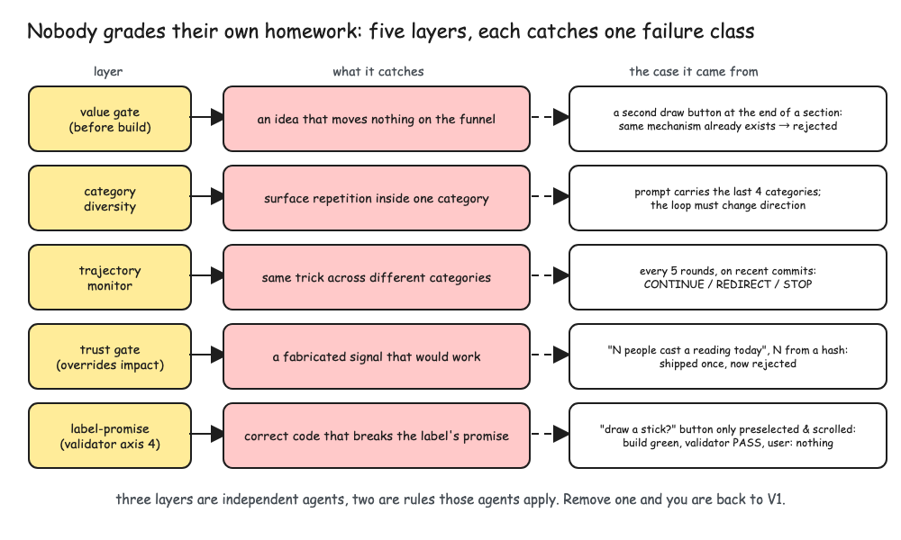
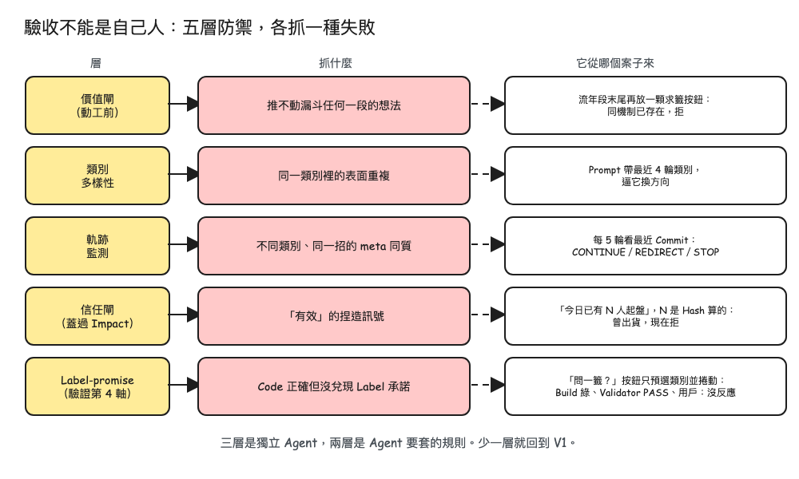
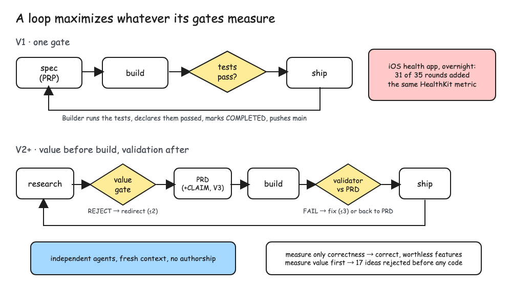
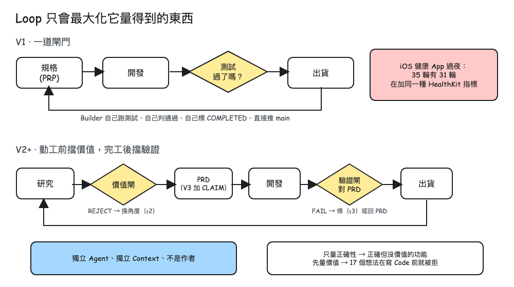
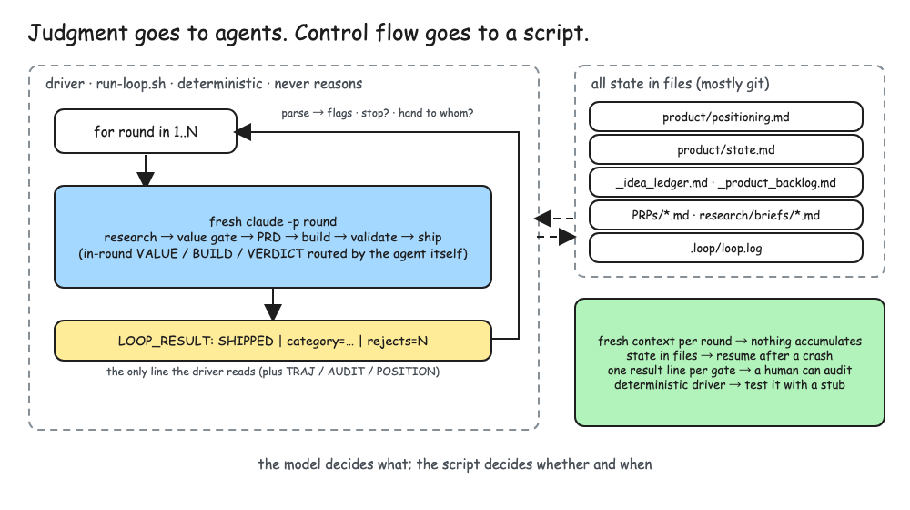
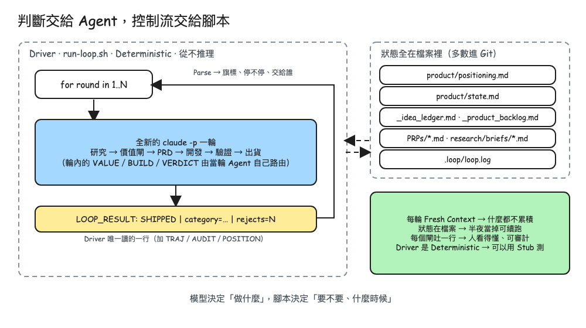
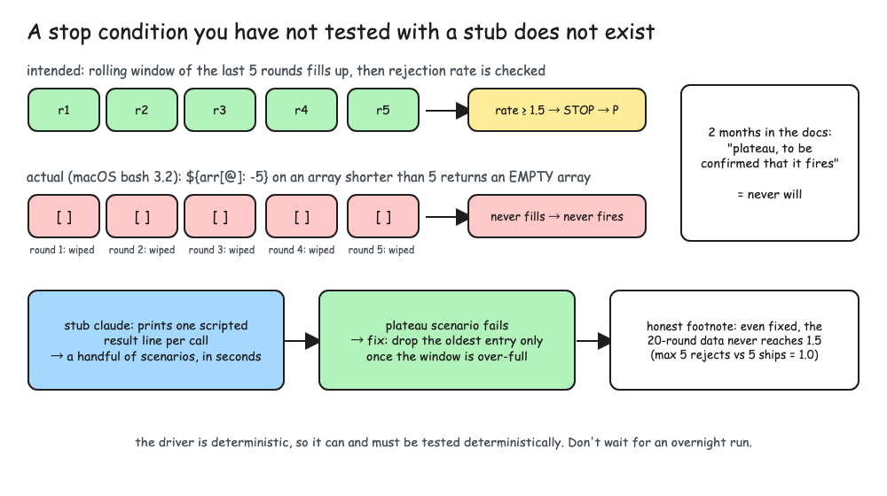
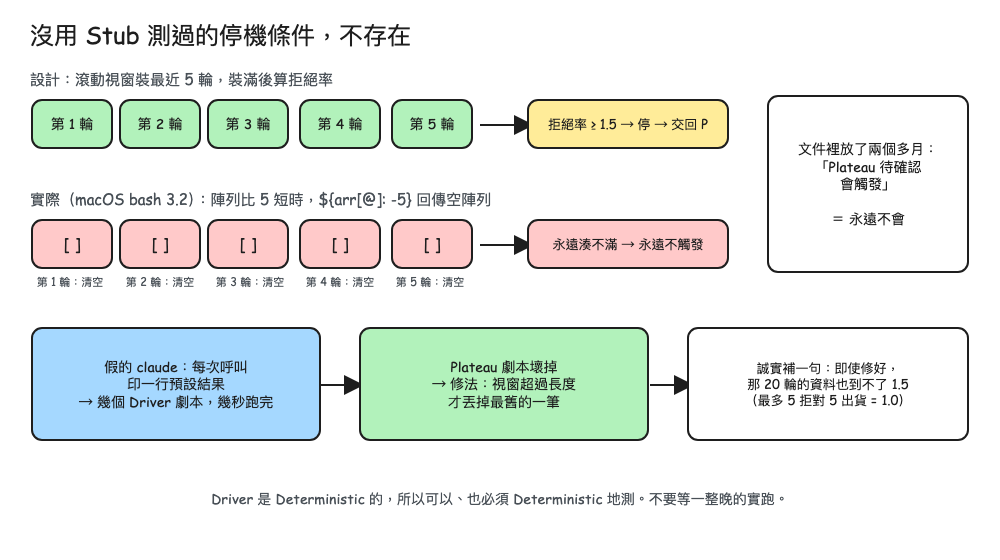
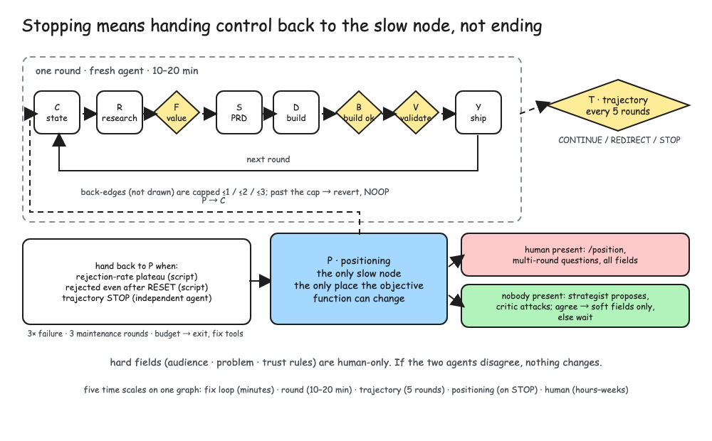
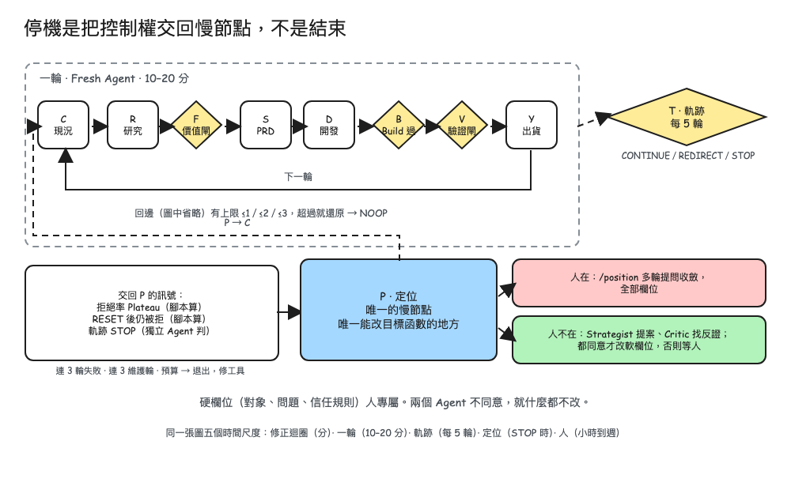

# excalidraw-figures

**Hand-drawn article figures from one bilingual spec.** Write the figure once in Python, get an editable `.excalidraw`, an SVG preview and a real-browser PNG for every language, plus a layout check that catches text overlaps before your readers do.



*From the article "Agents Only Build What You Measure": the same spec also produced the Traditional Chinese version below.*



## Why

Editorial diagram systems are precise and cold. For a personal blog, a talk, or a README written in the first person, the Excalidraw look reads as *someone drew this to explain something to you*, and the author can still open the file and move a box. The problem with drawing by hand is drift: five figures in two languages is ten files that fall out of sync the moment a label changes. So the figure lives in a spec; the files are outputs.

- **One spec, N languages.** Every label is `{"en": ..., "zh": ...}`. Add a language by adding a key.
- **Editable output.** Real `.excalidraw` JSON (schema v2, Excalidraw's own palette and font). Open it in [excalidraw.com](https://excalidraw.com) or the Obsidian Excalidraw plugin and keep drawing.
- **What the reader sees.** PNG rendered by headless Chrome from the preview SVG, so you check the actual pixels, not a thumbnail.
- **A check that fails.** `--check` reports text outside the canvas, text wider than its box, text over text, and free text straddling a box edge. Exit code 1 means fix it.
- **Small budget on purpose.** Three fills plus white, ≤ 10 boxes, labels never on lines. The discipline is in `skills/excalidraw-figures/references/style.md`.

## Install

**Claude Code (as a skill):**

```text
/plugin marketplace add InjayTseng/excalidraw-figures
/plugin install excalidraw-figures@excalidraw-figures
```

Then ask: *"draw the three-gate flow for this section as an excalidraw figure, EN and ZH"*. The skill loads `SKILL.md`, writes a spec, builds, checks, and looks at the PNGs.

**Editable install (any agent, or by hand):**

```bash
git clone https://github.com/InjayTseng/excalidraw-figures ~/code/excalidraw-figures
ln -s ~/code/excalidraw-figures/skills/excalidraw-figures ~/.claude/skills/excalidraw-figures
```

Requirements: Python 3.9+, no packages. PNG export needs Google Chrome or Chromium (`CHROME_BIN` to override the path); without it you still get `.excalidraw` and `.svg`.

## Quickstart

```bash
cp skills/excalidraw-figures/templates/spec-template.py my-figures.py
# edit the labels and boxes
python3 skills/excalidraw-figures/scripts/excalidraw_lib.py my-figures.py --out figures/ --png --check
open figures/F1-before-after-EN.png
```

A spec is a list of functions, one per figure:

```python
from excalidraw_lib import Diagram, GATE, AGENT, FAIL, FIX, NOTE, GRAY

def gate_flow(lang):
    d = Diagram("F1-gate-flow", 1000, 520, lang)
    d.title({"en": "State the claim, not the topic", "zh": "標題寫論點，不寫主題"})
    d.box(30, 110, 150, 60, {"en": "idea", "zh": "想法"})
    d.arrow(180, 140, 230, 140)
    d.box(230, 100, 170, 80, {"en": "worth it?", "zh": "值得嗎？"}, GATE, "diamond")
    d.arrow(400, 140, 450, 140, {"en": "yes", "zh": "是"})
    d.box(450, 110, 150, 60, {"en": "build", "zh": "開發"})
    d.path([(525, 170), (525, 215), (105, 215), (105, 170)], {"en": "next round", "zh": "下一輪"}, mid=(315, 215))
    return d

DIAGRAMS = [gate_flow]
```

## What is in the box

| Path | What |
|---|---|
| `skills/excalidraw-figures/SKILL.md` | The workflow an agent follows: one idea per figure, bilingual labels, build with `--check`, look at the PNGs |
| `skills/excalidraw-figures/scripts/excalidraw_lib.py` | The library and CLI. `Diagram`, `box`, `arrow`, `path`, `frame`, `text`, `title`, `check`, Excalidraw JSON writer, SVG preview, Chrome PNG |
| `skills/excalidraw-figures/references/style.md` | Palette roles, type sizes, width budget, layout rules, anti-patterns seen in practice |
| `skills/excalidraw-figures/templates/spec-template.py` | A before/after figure to copy from |
| `skills/excalidraw-figures/templates/components.py` | Component sheet: every box kind, arrow style and label size on one canvas (`templates/out/components-EN.excalidraw`) |
| `examples/loop-engineering/spec.py` | Five real figures from a published article, EN + ZH |

## The five example figures

| | EN | ZH |
|---|---|---|
| A loop maximizes whatever its gates measure |  |  |
| Judgment to agents, control flow to a script |  |  |
| A stop condition you have not tested does not exist |  |  |
| Stopping means handing control back |  |  |

## Design notes

- **Excalidraw's font has no CJK glyphs.** Excalidraw substitutes its bundled Xiaolai handwriting face, so the `.excalidraw` looks right inside Excalidraw. The SVG preview uses system fonts and is only an approximation; trust the PNG and Excalidraw itself.
- **The check is an estimate.** Width budget is 1em per CJK glyph and 0.55em per Latin glyph. It catches the gross errors; you still look at the picture.
- **Why not hand-author SVG?** Because the author wants to move a box afterwards. Editable first, pretty second.
- **Why not [diagram-design](https://github.com/cathrynlavery/diagram-design)?** It is excellent and this repo borrows its discipline (one focal element, labels off the line, a legend that fails). It optimises for editorial print; this one optimises for warmth and editability. Use whichever your piece needs.

## 繁體中文

一份 Python spec 進去，每個語言出一組：可編輯的 `.excalidraw`、SVG 預覽、headless Chrome 實渲染的 PNG，外加一個會失敗的版面檢查（文字出畫布、文字比框寬、文字疊文字、散文字壓框邊）。每個標籤寫一次 `{"en": ..., "zh": ...}`，中英永不脫節。

三種填色加白色、十個框以內、標籤不壓線，紀律在 `skills/excalidraw-figures/references/style.md`。範例是一篇已發表文章的五張圖，`examples/loop-engineering/spec.py`。

```bash
cp skills/excalidraw-figures/templates/spec-template.py my-figures.py
python3 skills/excalidraw-figures/scripts/excalidraw_lib.py my-figures.py --out figures/ --png --check
```

## License

MIT
